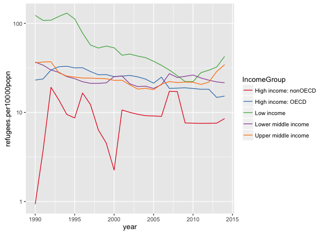

# Refugee Data
Tim Hill  
4 July 2016  


```r
library(dplyr)
library(ggplot2)
library(scales)
library(RColorBrewer)
```

The csv file is a combination of three different datasets from the WorldBank, see 
github.com/timhillnz/refugeedata/prepareData.R 

## Load prepared data and have a quick look at it - 


```r
refdata <- tbl_df(read.csv("./data/refugeeData.csv", na.strings = c("","NA")))
refdata <- select(refdata, -1)
head(refdata)
```

```
## Source: local data frame [6 x 8]
## 
##   Country.Name Country.Code                    Region          IncomeGroup
##         (fctr)       (fctr)                    (fctr)               (fctr)
## 1        Aruba          ABW Latin America & Caribbean High income: nonOECD
## 2      Andorra          AND     Europe & Central Asia High income: nonOECD
## 3  Afghanistan          AFG                South Asia           Low income
## 4       Angola          AGO        Sub-Saharan Africa  Upper middle income
## 5      Albania          ALB     Europe & Central Asia  Upper middle income
## 6   Arab World          ARB                        NA                   NA
## Variables not shown: year (int), numberRefs (int), popn (dbl), gdp (dbl)
```

```r
str(refdata)
```

```
## Classes 'tbl_df', 'tbl' and 'data.frame':	6200 obs. of  8 variables:
##  $ Country.Name: Factor w/ 248 levels "Afghanistan",..: 11 5 1 6 2 8 234 9 10 4 ...
##  $ Country.Code: Factor w/ 248 levels "ABW","AFG","AGO",..: 1 5 2 3 4 6 7 8 9 10 ...
##  $ Region      : Factor w/ 7 levels "East Asia & Pacific",..: 3 2 6 7 2 NA 4 3 2 1 ...
##  $ IncomeGroup : Factor w/ 5 levels "High income: nonOECD",..: 1 1 3 5 5 NA 1 1 4 5 ...
##  $ year        : int  1990 1990 1990 1990 1990 1990 1990 1990 1990 1990 ...
##  $ numberRefs  : int  NA NA 50 11557 NA 4235545 NA 11735 NA NA ...
##  $ popn        : num  62148 54511 12067570 11127870 3286542 ...
##  $ gdp         : num  NA NA NA NA 2749 ...
```

There are a number of NA's in the Region and Income Group variables.
Let's look at this a bit further - 

```r
## How many countries in each region?
refdata %>% group_by(Region)  %>% summarise(number = n_distinct(Country.Name))
```

```
## Source: local data frame [8 x 2]
## 
##                       Region number
##                       (fctr)  (int)
## 1        East Asia & Pacific     36
## 2      Europe & Central Asia     57
## 3  Latin America & Caribbean     41
## 4 Middle East & North Africa     21
## 5              North America      3
## 6                 South Asia      8
## 7         Sub-Saharan Africa     48
## 8                         NA     34
```

```r
## How many countries in each income group?
refdata %>% group_by(IncomeGroup)  %>% summarise(number = n_distinct(Country.Name))
```

```
## Source: local data frame [6 x 2]
## 
##            IncomeGroup number
##                 (fctr)  (int)
## 1 High income: nonOECD     47
## 2    High income: OECD     32
## 3           Low income     31
## 4  Lower middle income     51
## 5  Upper middle income     53
## 6                   NA     34
```

```r
## List the 'countries' with no region
noregions <- as.data.frame(refdata %>% distinct(Country.Name) %>% group_by(Country.Name) 
                           %>% filter(is.na(Region))) %>% droplevels()
noregions[,1]
```

```
##  [1] Arab World                                    
##  [2] Central Europe and the Baltics                
##  [3] Caribbean small states                        
##  [4] East Asia & Pacific (developing only)         
##  [5] East Asia & Pacific (all income levels)       
##  [6] Europe & Central Asia (developing only)       
##  [7] Europe & Central Asia (all income levels)     
##  [8] Euro area                                     
##  [9] European Union                                
## [10] Fragile and conflict affected situations      
## [11] High income                                   
## [12] Heavily indebted poor countries (HIPC)        
## [13] Not classified                                
## [14] Latin America & Caribbean (developing only)   
## [15] Latin America & Caribbean (all income levels) 
## [16] Least developed countries: UN classification  
## [17] Low income                                    
## [18] Lower middle income                           
## [19] Low & middle income                           
## [20] Middle East & North Africa (all income levels)
## [21] Middle income                                 
## [22] Middle East & North Africa (developing only)  
## [23] North America                                 
## [24] High income: nonOECD                          
## [25] High income: OECD                             
## [26] OECD members                                  
## [27] Other small states                            
## [28] Pacific island small states                   
## [29] South Asia                                    
## [30] Sub-Saharan Africa (developing only)          
## [31] Sub-Saharan Africa (all income levels)        
## [32] Small states                                  
## [33] Upper middle income                           
## [34] World                                         
## 34 Levels: Arab World ... World
```
 
So the NA's are aggregated data for various groupings.

## Refugee Data by country & population

```r
### All countries
plotdata1 <- refdata %>% filter(!is.na(Region))
plot1 <- ggplot(plotdata1, aes(x = year, y = numberRefs, colour = Country.Name)) +
  geom_line() + theme(legend.position = "none") + scale_y_log10(labels = comma)
plot1
```

 

That's a lot - and isn't particularly useful

Let's look at a subset of countries - those shown as High Income: OECD.

```r
plotdata2 <- refdata %>% filter(IncomeGroup == "High income: OECD") %>% droplevels()
plot2 <- ggplot(plotdata2, aes(x = year, y = numberRefs, colour = Country.Name)) +
  geom_line() + 
  scale_y_log10(labels = comma)
plot2
```

 

Somewhat better - but there's no standardisation and, with vastly different resident 
population numbers in those countries, it's not useful to compare raw numbers of refugees.

We'll create a new variable - number of refugees per 10,000 host population.


```r
## Create the new variable
refdata <- refdata %>% mutate(refugees.per10000popn = numberRefs/(popn/10000))

## Create a dataframe to show only the  OECD countries against the new variable
plotdata3 <- refdata %>% filter(IncomeGroup == "High income: OECD") %>% droplevels()

## Plot the data
plot3 <- ggplot(plotdata3, aes(x = year, y = refugees.per10000popn , colour = Country.Name)) +
  geom_line()  + scale_y_log10(labels = comma)
plot3
```

 

Still getting better - this time we'll limit the countries even further

```r
plotdata4 <- refdata %>% filter(Country.Name %in% 
                                  c("Australia","France","Germany","New Zealand",
                                    "United Kingdom","United States")) %>% 
  droplevels()

plot4 <- ggplot(plotdata4, aes(x = year, y = refugees.per10000popn , colour = Country.Name)) +
  geom_line()

plot4
```

 

Much better.

Now we'll look at the data for the OECD and other high income countries for 2014.

```r
## Create plot dataset for the selected countries.  
#Will also add a variable so Australia and NZ can be easily identified

plotdata5 <- refdata %>% 
  filter(year == "2014",IncomeGroup %in% c("High income: nonOECD", "High income: OECD"), 
         !is.na(refugees.per10000popn)) %>% 
  droplevels() %>% 
  mutate(fillcolour = ifelse(Country.Name %in% c("Australia", "New Zealand"), "Colour", NA))

## Reorder the data so the plot shows the countries from highest to lowest
plotdata5$Country.Name <- with(plotdata5, reorder(Country.Name, -refugees.per10000popn, mean))

## Create the plot ...
plot5 <- ggplot(plotdata5, aes(x = Country.Name, y = refugees.per10000popn, fill = fillcolour)) + 
  geom_bar(stat = "identity") + 
  theme(axis.text.x=element_text(angle=90,hjust=1,vjust=0.5)) +
  theme(legend.position = "none") +
  labs(title = "Number of Refugees per 10,000 population in 2014" )
  
### ... and display it.
plot5
```

 


### Compare World Regions
Aggregate the data under the *Region* variable and see how different parts of the world compare.  Again, the data has been standardised by number of refugees per 10,000 population

```r
regionData <- refdata %>% 
  filter(!is.na(Region)) %>%
  group_by(Region, year) %>%
  summarise(refugees = sum(numberRefs, na.rm = T), popn = sum(popn, na.rm = T)) %>%
  mutate(refugees.per10000popn = refugees/(popn/10000)) %>%
  ungroup()

plot6 <- ggplot(regionData, aes(x = year, y = refugees.per10000popn, colour = Region)) +
  geom_line() + scale_y_log10(labels = comma) + scale_colour_brewer(palette = "Set1")
plot6
```

 

We can see some real differences between the regions in this plot - and some strange data for the Latin America and Caribbean region that might be worthwhile looking into sometime.

### Compare by Income Group

Similar to the last plot, but this time we will aggregate by the Income grouping


```r
incomeData <- refdata %>% 
  filter(!is.na(IncomeGroup)) %>%
  group_by(IncomeGroup, year) %>%
  summarise(refugees = sum(numberRefs, na.rm = T), popn = sum(popn, na.rm = T)) %>%
  mutate(refugees.per10000popn = refugees/(popn/10000)) %>%
  ungroup()

plot7 <- ggplot(incomeData, aes(x = year, y = refugees.per10000popn, colour = IncomeGroup)) +
  geom_line() + scale_y_log10(labels = comma) + scale_colour_brewer(palette = "Set1")

plot7
```

 

Now this is interesting - the low income groups tend to have the largest refugee populations and the group with the lowest overall population is the non OECD high income countries. 


